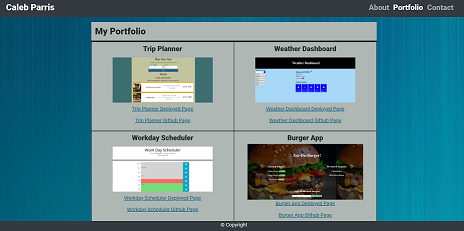

# Portfolio

This repository was made to showcase some projects that I have worked on during my time at the UT Austin Coding Bootcamp. It contains 3 sections:
* About Me
* Portfolio
* Contact

Here is the link ot the deployed site: https://calebparris.github.io/Portfolio/index.html

## About Me

This section give a brief description of myself and some of my previous work experience, as well as some of my future goals

## Portfolio

This section showcases some of my finished projects that I have worked on. It also includes links to the respective github page, as well as the deployed website link.

## Contact

This section includes my contact information, as well as links to my Githuib and LinkedIn profiles. There is also a form at the bottom of the page to send me an email directly.

